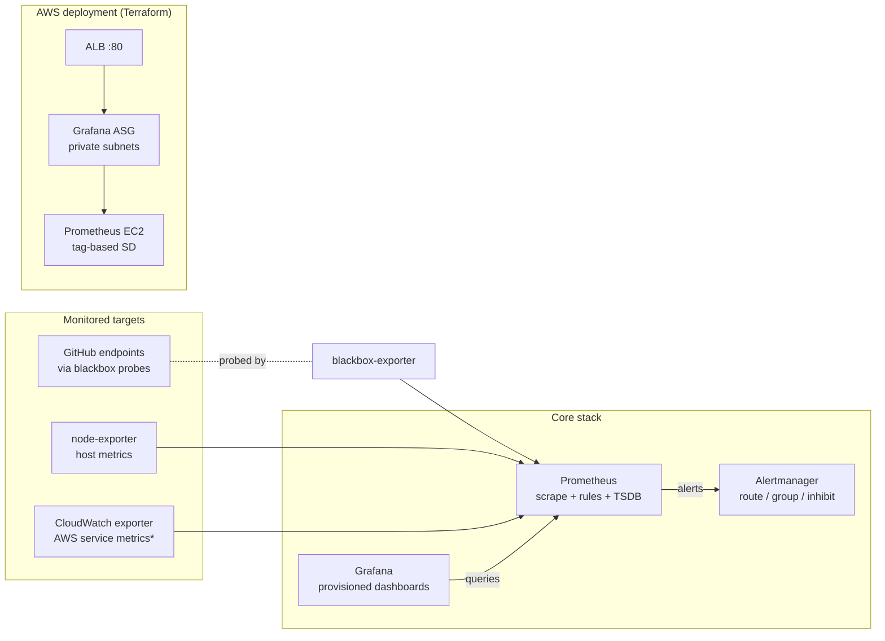

# AWS Monitoring & Observability Stack

[](https://github.com/mlakhoua-rgb/aws-monitoring-observability-stack/actions/workflows/ci.yml)
[](https://www.terraform.io/)
[](https://prometheus.io/)
[](https://grafana.com/)
[](LICENSE)

A Prometheus + Grafana + Alertmanager observability stack with two deployment paths:

1. **Local lab (Docker Compose)** — a fully working monitoring environment in one command, including a live blackbox-monitoring demo against GitHub's public endpoints: availability, latency, DNS, TLS handshake, SSL certificate expiry, and 12 production-style alert rules.
2. **AWS deployment (Terraform)** — Prometheus on EC2 with tag-based service discovery, Grafana in an Auto Scaling Group behind an ALB, security groups chained least-privilege (ALB → Grafana → Prometheus).

Every config in this repo is loaded and validated in CI — `promtool`, `amtool`, `terraform validate`, dashboard JSON checks, and `docker compose config` all gate merges.

---

## Quick start — working demo in one command

```bash
git clone https://github.com/mlakhoua-rgb/aws-monitoring-observability-stack.git
cd aws-monitoring-observability-stack
docker compose up -d
```

| Service | URL | Notes |
|---|---|---|
| Grafana | http://localhost:3000 | admin / admin (override with `GRAFANA_ADMIN_PASSWORD`) |
| Prometheus | http://localhost:9090 | targets, rules, and alert state |
| Alertmanager | http://localhost:9093 | routing tree and silences |
| Blackbox exporter | http://localhost:9115 | probe debug output |

Open **Dashboards → GitHub Services Monitoring** in Grafana: the panels are live within the first probe cycle (~2 minutes). Full walkthrough, alert catalog, and customization guide: **[GITHUB_MONITORING_GUIDE.md](GITHUB_MONITORING_GUIDE.md)**.

Optional profiles:

```bash
# + CloudWatch exporter (needs AWS credentials in the environment; set the
# query region in cloudwatch-exporter/config.yml). The cp enables the
# Prometheus scrape job — without a targets file the job is empty by design,
# so the plain lab never shows a dead target.
# With SSO/federated credentials, AWS_SESSION_TOKEN must be set too, e.g.:
#   eval "$(aws configure export-credentials --profile YOUR_PROFILE --format env)"
cp prometheus/targets/cloudwatch.yml.example prometheus/targets/cloudwatch.yml
docker compose --profile aws up -d

docker compose --profile logs up -d   # + Loki & Promtail log aggregation
```

---

## Architecture



\* CloudWatch exporter runs under the optional `aws` profile locally, or alongside the AWS deployment.

**Design decisions:**

- **Blackbox monitoring from the outside.** The demo probes public endpoints exactly as a user would reach them — no agent on the target, which is how you monitor third-party dependencies (payment providers, CDNs, upstream APIs) in practice.
- **Alert hygiene over alert volume.** Severity-tiered routing with inhibition rules: when `GitHubDown` fires, the derived latency/DNS/TLS warnings for the same endpoint are suppressed instead of paging three times for one outage.
- **Rate-limit-aware probing.** GitHub's unauthenticated API allows 60 requests/hour/IP; the probe cadence (2 min) is chosen so the monitoring never causes the outage it reports.
- **Configs are code.** Everything Grafana shows is file-provisioned (datasource with a fixed UID, dashboards from `grafana/dashboards/`), so `docker compose up` on a clean machine reproduces the exact same stack.

---

## Repository layout

```
├── docker-compose.yml            # Local lab: core stack + aws/logs profiles
├── prometheus/
│   ├── prometheus.yml            # Local lab config (self-contained, all targets exist)
│   ├── prometheus-aws.yml        # AWS config: EC2 service discovery + CloudWatch
│   ├── blackbox.yml              # Probe modules (HTTP, TCP, ICMP, DNS)
│   ├── alert_rules/              # Infrastructure alerts (node, ALB, RDS, S3)
│   └── alerts/                   # GitHub demo alerts (12 rules, severity-tiered)
├── alertmanager/alertmanager.yml # Routing tree, inhibition rules, receiver stubs
├── grafana/
│   ├── provisioning/             # Datasource (fixed uid) + dashboard providers
│   └── dashboards/               # GitHub monitoring, EC2, AWS infrastructure
├── cloudwatch-exporter/          # Curated AWS metric list (cost-aware)
├── loki/ · promtail/             # Log aggregation configs (logs profile)
├── terraform/                    # AWS deployment (root + prometheus/grafana modules)
└── docs/                         # Architecture, deployment, troubleshooting, runbooks
```

---

## Dashboards

| Dashboard | File | What it shows |
|---|---|---|
| GitHub Services Monitoring | `github_monitoring.json` | 10 panels: endpoint status, uptime, response time, DNS, TLS handshake, HTTP codes, SSL expiry, availability trend |
| EC2 Instance Monitoring | `ec2_monitoring.json` | node-exporter CPU, memory, disk, network |
| AWS Infrastructure Overview | `aws-infrastructure.json` | starter dashboard for CloudWatch exporter metrics |

## Alert rules

| File | Scope | Highlights |
|---|---|---|
| `prometheus/alerts/github_alerts.yml` | GitHub demo (12 rules) | down/degraded, slow response, DNS latency, TLS handshake, SSL expiry (30d/7d), HTTP 4xx/5xx, 99% SLA breach, multi-endpoint outage |
| `prometheus/alert_rules/infrastructure.yml` | Infrastructure | node CPU/memory/disk, instance down, network errors, ALB response time, RDS CPU, S3 errors |

Alertmanager routes by severity (critical 5m repeat, warning 30m, info 4h) and ships with commented receiver stubs for Slack/email/webhook — wire in your own endpoints.

---

## AWS deployment

```bash
cd terraform
cp terraform.tfvars.example terraform.tfvars   # set VPC, subnets, Grafana password
terraform init
terraform plan
terraform apply
terraform output grafana_url
```

What you get:

- **Prometheus** on EC2 (encrypted gp3 root volume, 15-day retention) discovering node-exporter targets by tag `Monitoring=enabled` — instance role carries the `ec2:DescribeInstances` permission that service discovery needs.
- **Grafana** in an ASG (1–2 instances, private subnets) behind an internet-facing ALB with an `/api/health` health check; the Prometheus datasource is file-provisioned by user_data.
- **Security groups** chained: internet → ALB (:80) → Grafana (:3000, ALB SG only) → Prometheus (:9090, Grafana SG + trusted CIDRs only).

Step-by-step guide: [docs/DEPLOYMENT.md](docs/DEPLOYMENT.md)

### Honest limitations (read before production)

- **Prometheus is single-node.** Data survives restarts (Docker volume on EBS), not instance replacement. For durable/HA metrics, add `remote_write` to Amazon Managed Prometheus or Thanos — the config stub is in `prometheus-aws.yml`.
- **The ALB terminates plain HTTP.** Attach an ACM certificate and an HTTPS listener before exposing it beyond a demo; Grafana auth is the only gate on :80.
- **Grafana admin password travels via user_data** (readable in launch template versions). Use Secrets Manager or SSO for anything real.
- **Alertmanager is not deployed by the Terraform** — it runs in the local lab; on AWS, point Prometheus at your existing Alertmanager or add a module for it.
- **No ECS service discovery** — Prometheus has none natively; use a file_sd discovery sidecar if you need it.

---

## What it costs to run (AWS deployment, defaults)

| Component | Configuration | Estimate/month |
|---|---|---|
| Prometheus EC2 | t3.medium + 50 GB gp3 | ~$34 |
| Grafana EC2 | t3.small ×1 (ASG 1–2) | ~$15 |
| ALB | 1 ALB, light traffic | ~$16–20 |
| CloudWatch exporter API calls | curated metric list, 300s period | ~$1–5 |
| **Total** | | **~$66–75** |

The local Docker Compose lab costs nothing. The CloudWatch exporter metric list is deliberately short — every metric is an API call every 5 minutes; extend it consciously.

---

## CI

Every push and PR runs ([ci.yml](.github/workflows/ci.yml)):

- `terraform validate` + `terraform fmt -check` over root and modules
- `tfsec` scan (advisory)
- `promtool check config` on **both** Prometheus configs and `promtool check rules` on **all** rule files
- `amtool check-config` on the Alertmanager config
- Dashboard JSON validation (valid JSON, provisioning-ready shape, panels present)
- `docker compose config` across all profiles

---

## Documentation

- [GITHUB_MONITORING_GUIDE.md](GITHUB_MONITORING_GUIDE.md) — the demo: setup, alert catalog, PromQL examples, alert testing
- [docs/ARCHITECTURE.md](docs/ARCHITECTURE.md) — components, data flow, design decisions and limitations
- [docs/DEPLOYMENT.md](docs/DEPLOYMENT.md) — AWS deployment walkthrough
- [docs/TROUBLESHOOTING.md](docs/TROUBLESHOOTING.md) — common issues and fixes
- [docs/RUNBOOKS.md](docs/RUNBOOKS.md) — what to do when each alert fires
- [WINDOWS_SETUP.md](WINDOWS_SETUP.md) — running the local lab on Windows
- [CONTRIBUTING.md](CONTRIBUTING.md) — how to contribute

---

## Development approach

Developed AI-assisted (Claude and other coding agents) with human review of every change — same as my day-to-day platform work. The engineering judgment is the human part: probe cadences that respect rate limits, alert thresholds and inhibition that avoid pager fatigue, and stating limitations instead of claiming HA that isn't there. CI enforces the floor: every config file in this repo is parsed and validated on every change.

**Disclaimer:** educational/portfolio project. Thresholds, retention, and alert rules are examples — align them with your own SLOs before production use. No employer-specific content is included.

---

## Contact

**Author:** Mohamed Ben Lakhoua
**LinkedIn:** [linkedin.com/in/benlakhoua](https://linkedin.com/in/benlakhoua)
**Email:** Mohamed@metafive.ai
**GitHub:** [github.com/mlakhoua-rgb](https://github.com/mlakhoua-rgb)

*Last updated: July 2026*
