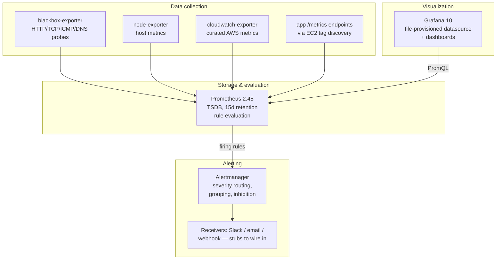

# AWS Monitoring & Observability Stack — Architecture

Components, data flow, and the reasoning behind the design — including what this stack deliberately does *not* do.

## Guiding principles

- **Actionable alerting.** Every alert has a severity, a route, and a runbook entry ([RUNBOOKS.md](RUNBOOKS.md)). Inhibition rules suppress derived symptoms when the root alert fires.
- **Configs are code, and CI proves them.** Every Prometheus config, rule file, Alertmanager config, dashboard, and Terraform module in this repo is parsed and validated on every change.
- **Monitor from the outside first.** Blackbox probes see what users see; agent metrics explain *why* afterwards.
- **Honest scope.** Single-node Prometheus with documented durability limits beats a fictional HA diagram.

## System components

### Data collection

| Source | What | Discovery |
|---|---|---|
| blackbox-exporter | External endpoint probes: success, duration (per phase incl. TLS), DNS time, HTTP code, SSL expiry | Static target list in `prometheus.yml` |
| node-exporter | CPU, memory, disk, network of hosts | Local lab: static; AWS: EC2 tag `Monitoring=enabled` |
| cloudwatch-exporter | RDS, ALB, Lambda, S3, EC2 metrics from CloudWatch | Static; metric list curated in `cloudwatch-exporter/config.yml` for API cost control |
| Application `/metrics` | Custom app metrics | AWS: EC2 tag `MetricsPort=8080` |

Two Prometheus configs exist on purpose: `prometheus.yml` is the **local lab** config where every referenced target exists in docker-compose (so the demo works on a clean machine), and `prometheus-aws.yml` is the **AWS** config with EC2 service discovery. Mixing them produces either a broken demo or dead AWS config — they stay separate and both are CI-validated.

### Alerting

- **Severity tiers:** critical (5m repeat), warning (30m), info (4h) — routed independently in `alertmanager/alertmanager.yml`.
- **Inhibition:** a critical alert suppresses same-name warnings for the same instance; `GitHubDown` suppresses the latency/DNS/TLS alerts it would inevitably drag along.
- **Receivers ship as commented stubs.** Slack webhooks and SMTP credentials do not belong in a public repo; the routing logic is real, the endpoints are yours to add.

### Visualization

Grafana is fully file-provisioned: the Prometheus datasource is pinned to `uid: prometheus` (dashboards reference that uid — an auto-generated uid would orphan every panel), and dashboards load from `grafana/dashboards/`. No clicking required to reproduce the stack.

## Data flow

1. **Scraping:** Prometheus pulls from node-exporter, blackbox-exporter (which probes external endpoints on demand), the CloudWatch exporter, and any discovered application `/metrics` endpoints.
2. **Storage:** samples land in the Prometheus TSDB (15-day retention by default).
3. **Evaluation:** alert rules evaluate every 15s; firing alerts go to Alertmanager.
4. **Routing:** Alertmanager groups, deduplicates, inhibits, and routes by severity to the configured receivers.
5. **Visualization:** Grafana queries Prometheus over PromQL; users reach Grafana through the ALB (AWS) or localhost (lab).

## AWS deployment topology

- **Prometheus:** one EC2 instance (Docker), encrypted gp3 root volume, config written by user_data *before* the container starts — a bind-mount to a nonexistent file would silently become an empty directory.
- **Grafana:** Auto Scaling Group (1–2, private subnets) behind an internet-facing ALB; target group health check hits `/api/health` (Grafana's `/` answers 302, which fails a default health check).
- **Security groups:** internet → ALB `:80` → Grafana `:3000` (source = ALB SG) → Prometheus `:9090` (source = Grafana SG + trusted operator CIDRs).
- **IAM:** SSM Session Manager access (no SSH keys) + `ec2:DescribeInstances` for Prometheus service discovery. Nothing else.

## Deliberate limitations

- **Prometheus HA is out of scope.** Metrics survive container restarts, not instance replacement. The supported growth path is `remote_write` to Amazon Managed Prometheus or Thanos (stub in `prometheus-aws.yml`) — not a second Prometheus with duplicate scrapes.
- **TLS terminates nowhere by default.** The ALB listener is HTTP :80. Add an ACM cert + HTTPS listener (and redirect) before real use.
- **Alertmanager runs in the local lab only** — the Terraform does not deploy it. Point the AWS Prometheus at your existing Alertmanager, or extend the Terraform.
- **Grafana admin password via user_data** is readable by anyone with `ec2:DescribeLaunchTemplateVersions`. Secrets Manager or OAuth/SSO is the production answer.
- **No ECS service discovery** — Prometheus has none built in; ECS workloads need a file_sd sidecar (e.g. prometheus-ecs-discovery).
- **Logs (Loki) and traces are lab extras**, not part of the AWS deployment.
